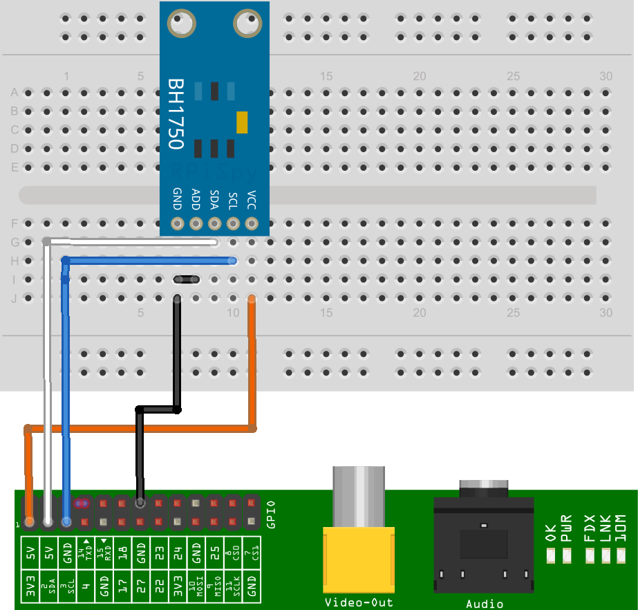
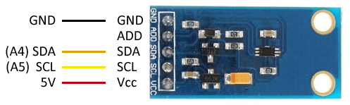

# raspberry-sensor-bh1750

Repositorio con script y clases para trabajar fácilmente con el sensor de cantidad de luz que tiene el chip bh1750

Especificaciones técnicas: https://www.mouser.com/ds/2/348/bh1750fvi-e-186247.pdf

## Esquema de conexión

| Module | PCB Desc | GPIO Header Pins |
| ------- | ------- | ------- |
| GND | Ground | P1-14 |
| ADD | Address select | P1-14 |
| SDA | I2C SDA | P1-03 |
| SCL | I2C SCL | P1-05 |
| VCC | 3.3V | P1-01 |

## Medición

El BH1750 tiene un amplio rango de medición ajustable desde los 0.11 a 100000 lux, por lo que es capaz de medir en casi cualquier situación de iluminación. Incorpora un ADC de 16bits que proporciona una resolución de 65535 niveles.

El sensor BH1750 tiene una baja influencia al espectro infrarrojo, rechazo al ruido de 50/60 Hz (luz artificial) y alta independencia del origen de la fuente de luz (luz natural, halógenos, LED, incandescencia).

arduino-luxometro-bh1750-interior

| Situación | Luxes |
| ---- | ---- |
| Noche | 0.001-0.02 |
| Luna llena |  0.2-0.6 |
| Día nublado, en interior |    5-50 |
| Día nublado, en exterior |    50-500 |
| Día soleado, en interior |    100-1000 |
| Bajo luz directa del sol |    100.000 |
| Habitación, salón |   150-300 |
| Mesa oficina/lectura |    500-700 |
| Supermercados/exposiciones |  750-1000 |
| Mesas dibujo/trabajo |    1000-1500 |

## Modos de medición

Para realizar la lectura del BH1750 usaremos la librería desarrollada por Christopher Laws, disponible en este enlace.

La librería proporciona ejemplos de código, que resulta aconsejable revisar. Los siguientes ejemplos son modificaciones a partir de los disponibles en la librería

El sensor dispone de 3 modos de resolución, siendo el predeterminado el modo «High Resolution Mode».

| Modo | Resolución | Tiempo de medición |
| ---- | ---- | ---- |
| High resolution Mode2 | 0.5 lx | 120 ms |
| High Resolution Mode | 1 lx | 120 ms |
| Low Resolution Mode | 4 lux | 16 ms |

 Adicionalmente existen 2 modos de disparo, «Continuo» y «One Time».
 En el modo continuo el BH1750 realiza constantemente mediciones mientras que en el modo disparo único realiza la medición bajo demanda, pasando a modo baja energía entre solicitudes.
